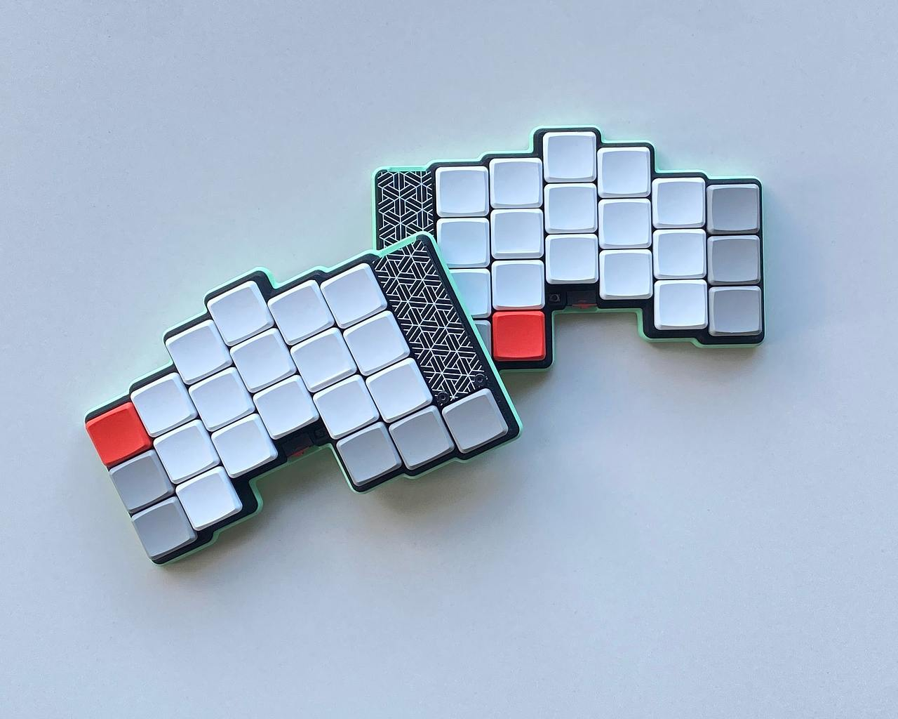
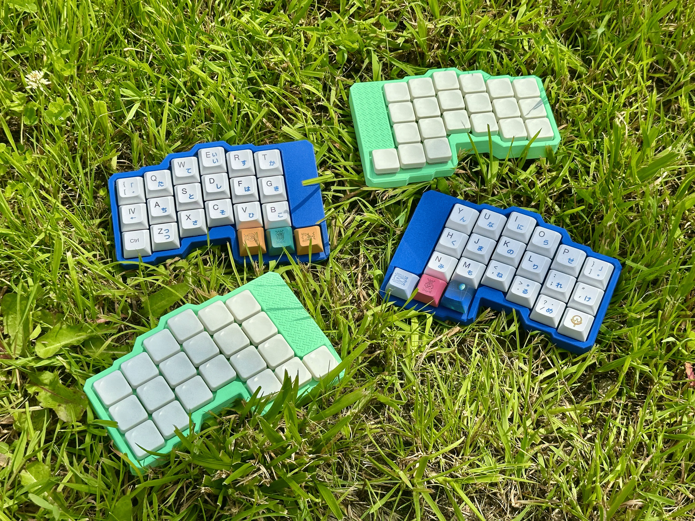
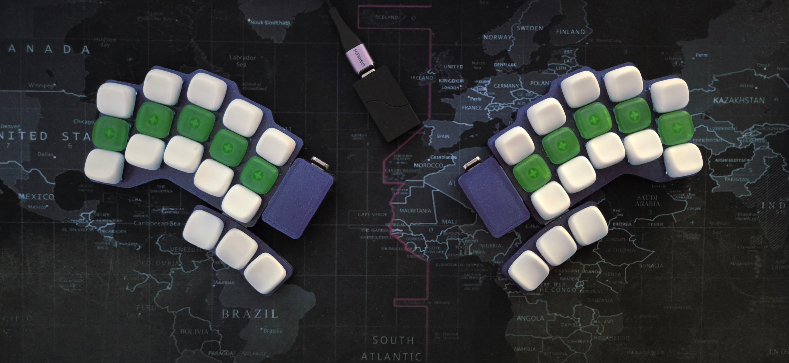
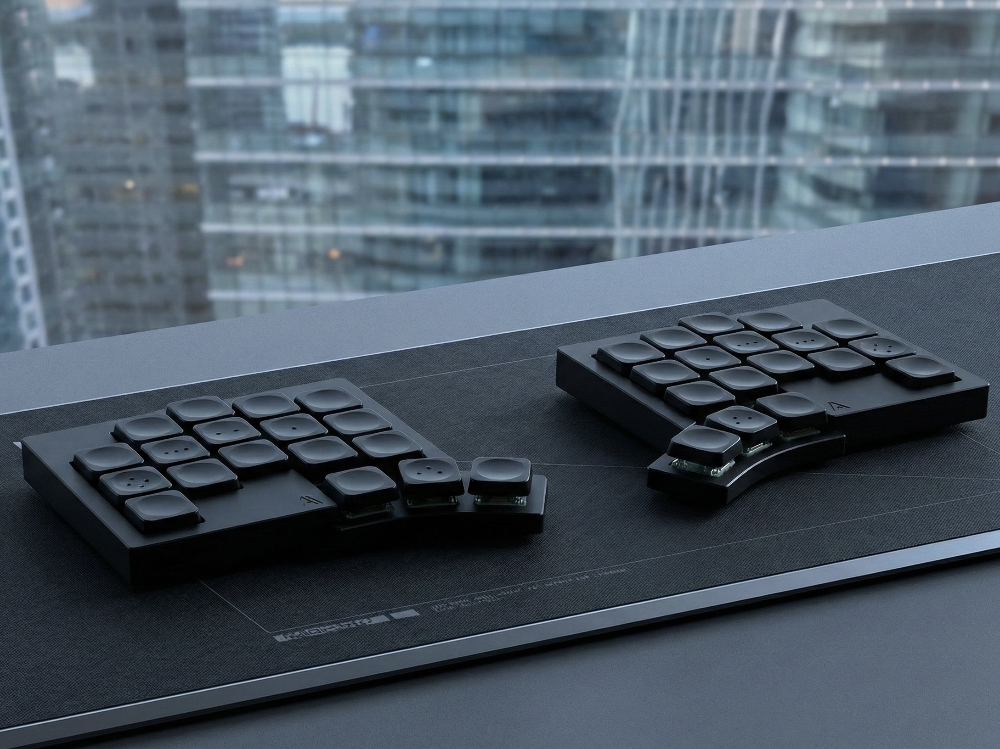
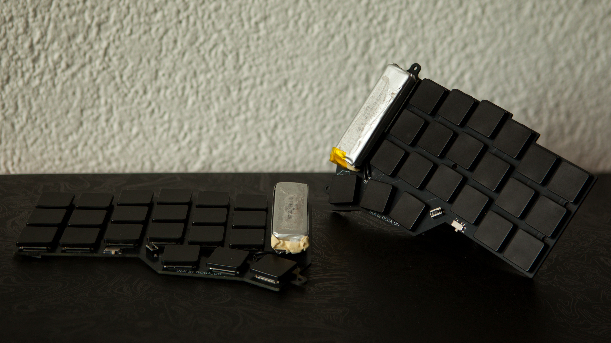
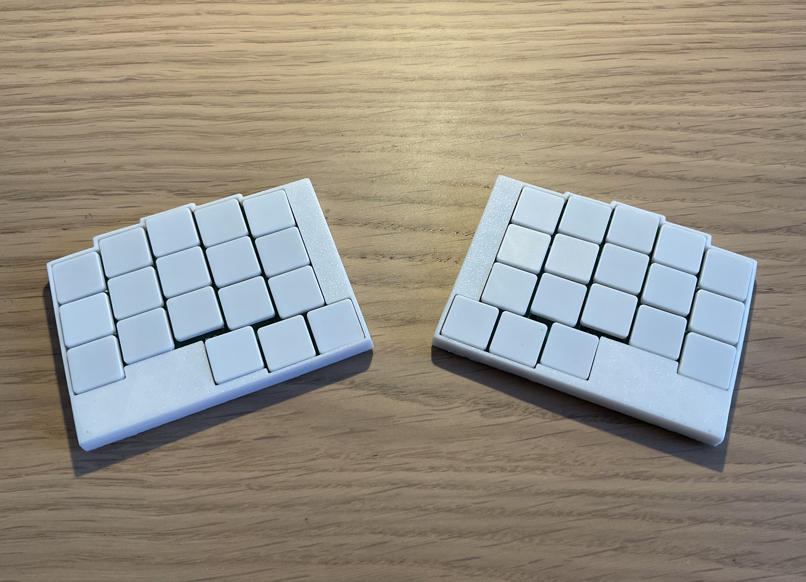

| Name           | Pictrue                                  | Key count | Tag                                                                                                        | Contributors                          | Link                                                | License         |
| -------------- | ---------------------------------------- | --------- | ---------------------------------------------------------------------------------------------------------- | ------------------------------------- | --------------------------------------------------- | --------------- |
| fEnki          |               | 42        | #split #columnar #dual-mode #drop-in #pro-micro #reversible #per-switch-pcb #solder #chocV1 #statusLED  | aroum                                 | https://github.com/aroum/fEnki                      | GPL-3.0         |
| KOMETA         |            | 42        | #split #columnar #wireless #pro-micro #breakable #multi-switch #hotswap #chocV1 #chocV2 #mid-mount-MCU     | inpudiy team                          | https://github.com/inpudiy/KOMETA                   | CERN-OHL-P-2.0  |
| Osprey         |             | 42        | #unibody  #columnar #wireless #onboard #nRF52840 #per-switch-pcb #hotswap #chocV1                          | ebastler                              | https://github.com/ebastler/osprey                  | CERN-OHL-Pe     |
| lapka          |               | 36        | #split #wireless #drop-in #pro-micro #splay #breakable #multi-switch #hotswap #chocV1 #chocV2 #direct-pin  | braindefender                         | https://github.com/braindefender/lapka              | CC-BY-SA-4.0    |
| TOTEM          |               | 38        | #split #splay #dual-mode #castellated #XIAOBLE #XIAORP2040 #breakable #per-switch-pcb #hotswap #chocV1     | GEIGEIGEIST                           | https://github.com/GEIGEIGEIST/TOTEM                | CERN-OHL-P-2.0  |
| Ergonaut One   |                   | 42        | #split #columnar  #wireless #castellated #XIAOBLE #reversible #per-switch-pcb #hotswap #KS-27/33           | yumagulovrn, krikun98, Ladniy,pashutk | https://github.com/ergonautkb/one                   | CERN-OHL-P-2.0  |
| chocofi        |          | 36        | #split #columnar  #wired #drop-in #pro-micro #reversible #per-switch-pcb #hotswap #chocV1                  | pashutk,l4u,beta-tank                 | https://github.com/pashutk/chocofi                  | CERN-OHL-P-2.0  |
| vrifmus        |               | 42        | #split #columnar #wireless #pro-micro #handwired #hotswap #chocV1                                          | vrifmus                               | https://github.com/vrifmus/hEnki                    |                 |
| soroka         |             | 52        | #unibody #staggered #wired #pin-header  #RP2040-Zero  #single #per-switch-pcb #hotswap #MX #encoder        | kapee1                                | https://github.com/kapee1/soroka                    | Unlicense       |
| Silakka54      |       | 54        | #split #columnar #wired #pin-header #RP2040-Zero #columnar #reversible #per-switch-pcb #hotswap #MX        | Squalius-cephalus                     | https://github.com/Squalius-cephalus/silakka54      | MIT             |
| delta-omega    |  | 34        | #split #splay #wireless #castellated #XIAOBLE #breakable #per-switch-pcb #solder #ULP #cnc-case #statusLED | unspecworks                           | https://github.com/unspecworks/delta-omega          | CERN-OHL-W-2.0  |
| mikecinq       |         | 36x       | #unibody #columnar  #wireless #surface #single  #per-switch-pcb #solder #ULP                               | mikeholscher                          | https://github.com/mikeholscher/zmk-config-mikecinq | CC BY-NC-SA 4.0 |
| TheEndgame2024 |   | 36        | #unibody #columnar #wired #castellated #RP2040-Zero #single #per-switch-pcb #hotswap #chocV1               | OldMan6955                            | https://github.com/OldMan6955/TheEndgame2024/       | CERN-OHL-S-2.0  |
| LoremIpsum36   |         | 36        | #unibody #columnar #wired #castellated #RP2040-Zero #single  #per-switch-pcb #hotswap #KS-27/33            | penk, Na-Cly                          | https://github.com/penk/LoremIpsum36                | MIT             |
| urchin         |             | 34        | #split #columnar #wireless #drop-in #pro-micro #breakable  #per-switch-pcb #hotswap #chocV1 #nice-view     | duckyb                                | https://github.com/duckyb/urchin                    | MIT             |
| karma          |              | 36        | #split #columnar  #wireless #castellated #XIAOBLE #single #per-switch-pcb #hotswap #chocV1                 | achyudh                               | https://github.com/achyudh/karma                    | CERN-OHL-S-2.0  |
| ULK            |                   | 42        | #split #columnar  #wireless #drop-in #pro-micro #breakable #per-switch-pcb #ULP                            | Goga64                                | https://github.com/Goga64/ULK                       | MIT             |
| leptosis       |         | 36        | #split #columnar  #wireless #onboard #nRF52840 #single #per-switch-pcb #ULP                                |                                       | https://github.com/cheyao/leptosis                  | SHL 2.1         |
| chalk          |              | 42        | #split #splay  #wireless #castellated #XIAOBLE #breakable #per-switch-pcb #ULP                             | vuoz                                  | https://github.com/vuoz/chalk                       | BY-NC-SA 4.0    |
